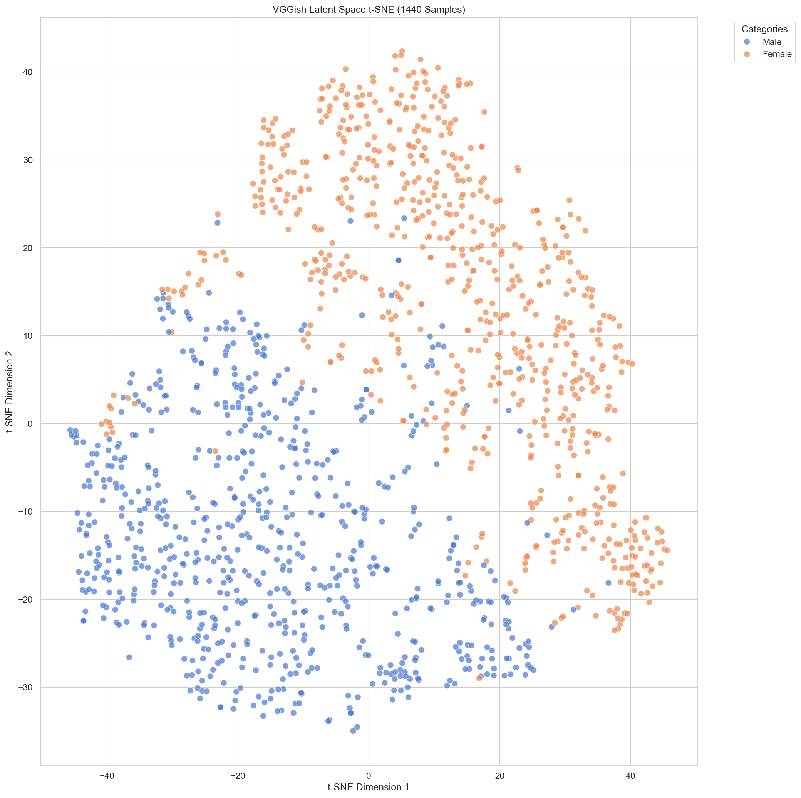
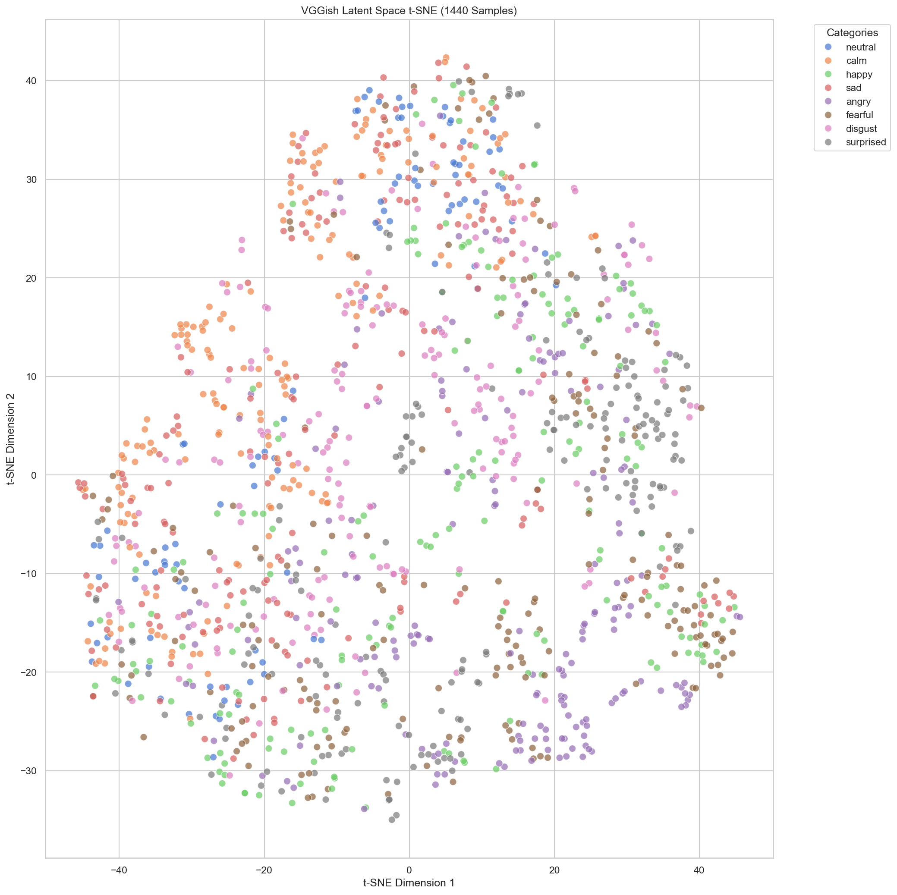
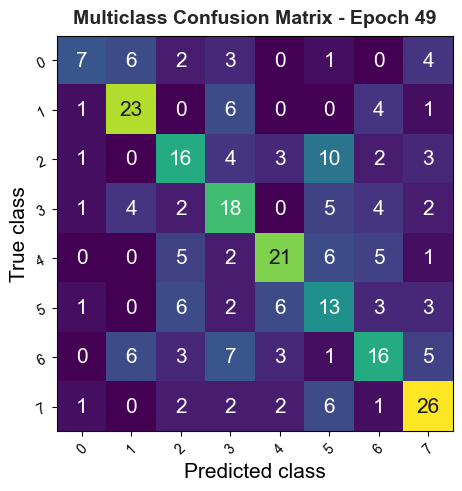

# Emotion and Gender Classification 
NOTE: Waiting for academic grading to complete before publicly releasing code
## Summary

This coursework explores how Temporal Convolutional Networks classify emotion and gender in speech and song from VGGish embeddings. Two model architectures are used in this experiment. The first model produces embeddings from a VGGish implementation with pretrained weights, using the RAVDESS dataset as input. The second model performs two different classification tasks, identifying emotion and gender using the same TCN. Recent work has applied TCN models to emotion recognition using concatenated spectrogram feature vectors, and their stability compared to LSTMs makes them easier to use to train. A similar model employs two separate classification heads.

## Architecture 
The VGGish code in lightning.py is a re-implementation of an archived Github repository
https://github.com/harritaylor/torchvggish/tree/master. VGGish was originally implemented using the Tensorflow Python library, and this repository converts it to Pytorch. The spectrogram method was replaced to use existing Pytorch methods for spectrogram calculation. The STFT parameters were retained since they match the original VGG implementation. The PCA post-processor is left in for future tinkering, but not actually needed for the combined system. 

While the VGGish front-end effectively models complex timbral phenomena, a fundamental limitation of the CNN architecture is the loss of intra-frame temporal resolution. The application of strided max-pooling and terminal fully connected layers flattens the 96×64 spectrotemporal matrix into a static 128-dimensional vector, effectively destroying the chronological ordering of microacoustic events within the 0.96-second window. By extracting continuous, ordered embeddings over the duration of the audio file, the chronological sequence of these static latent representations is retained by the output tensor [T, 128]. The Receptive Field of this TCN is calculated by $RF_{\text{TCN}} = 1 + \sum_{i=1}^{L} (k_i - 1) \times d_i$ where L = 2 Convolutional Layers, ki = 3 is the kernel size, and di = 2 is the dilation factor for each layer. The Receptive Field for the TCN block is 9 time steps of 0.96 seconds as a result of this calculation. 

## Evaluation 
### Embeddings visualization 




### Emotion Confusion Matrix 


# Code Execution 

## How to use

1. Install the Python dependencies:
	```bash
	pip install -r requirements.txt
	```
2. Open `training_and_evaluation_submission.ipynb` in Jupyter or VS Code.
3. Run the notebook cells from top to bottom.
4. The notebook will download the RAVDESS data, build embeddings, train the model, and run evaluation.

## Notes

- Use a GPU if available for faster training.
- Outputs such as checkpoints, logs, and plots are written to the project folders created by the notebook.
